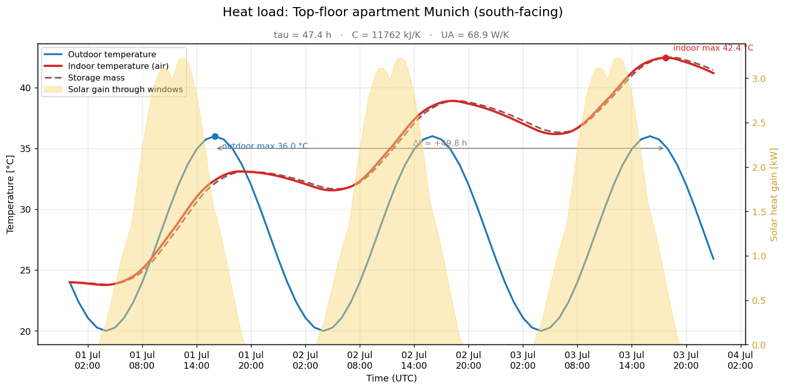
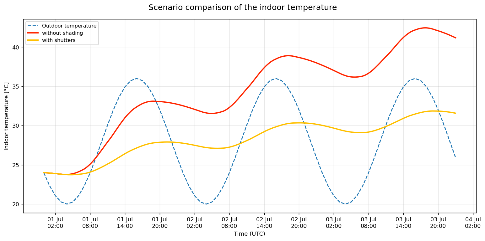
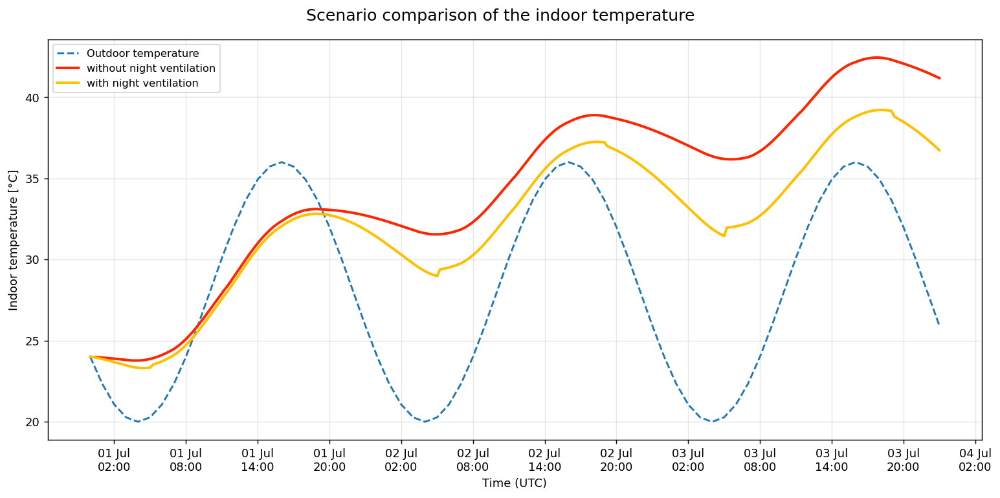

# 🌡️ heat-retention-calculator

[](https://github.com/florian-grassl/heat-retention-calculator/actions/workflows/ci.yml)
[](LICENSE)


Simulates and visualizes how an apartment **absorbs, stores and releases**
heat during a heatwave 



*Red = indoor air, brown dashed = storage mass, blue = outdoor, yellow = solar
gain through the windows. Note how the indoor maximum arrives well after the
outdoor one (the phase shift Δt) and how the apartment barely cools at night.*

---

## The idea in one sentence

Thermally, an apartment behaves like a **capacitor with a resistor** (an RC
element): the sun and warm outside air charge it up, the storage mass (floor,
walls, furniture) holds the heat, and it only discharges slowly through windows
and walls. Exactly this inertia causes the *phase shift* – the indoor maximum
arrives **hours after** the outdoor maximum.

## The physical model

The indoor temperature `T_indoor(t)` is modelled as **one thermal node** (a
first-order RC model). The heat balance reads:

```
C · dT/dt = Q_solar(t) + Q_convective(t) − Q_loss(t)
```

| Symbol | Meaning | electrical analogy |
|--------|---------|--------------------|
| `T`  | indoor temperature | voltage |
| `C`  | thermal storage capacity `[J/K]` | capacitor |
| `UA` | envelope conductance `[W/K]` = `Σ U·A` | conductance `1/R` |
| `τ`  | time constant `= C/UA` `[s]` | `R·C` |

The convective gain and the loss are **the same physics with opposite sign**
and are combined into one term:

```
Q_envelope(t) = UA · (T_out(t) − T_indoor(t))
   T_out > T_indoor → heat flows in  (gain)
   T_out < T_indoor → heat flows out (loss, e.g. at night)
```

The solar gain through the windows is always a gain and is projected onto each
window's facade (the solar position is computed internally):

```
Q_solar(t) = Σ_windows  area · g_effective · irradiance_on_facade(t)
```

* **`C`** = air + all storage masses: `C = Σ (area · thickness · density · c_p)`
  → a lot of storage mass = sluggish, large `τ`, a late and damped maximum.
* **`τ`** in hours is the key figure: *"this is how long the heat keeps
  reverberating."* After ~`τ` hours a step change is ~63 % through, after `3·τ`
  the apartment has practically followed the new outdoor state.

The material properties (density, `c_p`) live in a small material database
(`heat_calc/materials.py`).

### 1-node vs. 2-node model

The simple model lumps **air and heavy components into one node** with *one*
temperature. That is intuitive, but underestimates the fast heat-up of the room
air (the air is forced to react as sluggishly as a concrete ceiling) and
therefore overestimates the phase lag.

The more accurate **2-node model** (`simulate_2node`, the CLI default)
separates the two:

```
C_air  · dT_air/dt  = H_ao·(T_out − T_air)  + H_am·(T_mass − T_air)  + f·Q_solar
C_mass · dT_mass/dt = H_mo·(T_out − T_mass) + H_am·(T_air  − T_mass) + (1−f)·Q_solar
```

* `H_ao` = windows + ventilation (fast path to the **air**)
* `H_mo` = walls/roof (transmission to the **mass**)
* `H_am` = `h · A_interior` (interior surface coupling, `h ≈ 7.7 W/m²K`)
* `f` = fraction of the sun that directly heats the air (the rest hits the masses)

The system has **two time constants**: a *fast* one (minutes, the air) and a
*slow* one (hours to days, the storage mass). Both are computed from the
eigenvalues of the system matrix and reported. The air node is stiff (very
short time constant); the integrator therefore uses automatic **sub-stepping**
to keep the explicit Euler method stable.

### Night ventilation (`heat_calc/ventilation.py`)

The most effective behavioural lever: windows closed during the day, **ventilate
strongly at night** to discharge the storage mass. A `VentilationStrategy`
returns the air change rate (ACH) for every point in time. With `smart=True`
extra ventilation happens at night *only* when it is actually cooler outside
than inside – otherwise an open window would provide no cooling. The ACH enters
the air node as a time-dependent ventilation conductance `H_V = ACH · V · ρ · c / 3600`.

## What actually helps? (scenario comparison)

The CLI can run two scenarios side by side. On the synthetic heatwave the
difference is striking.

**Shutters / external shading** – the single most effective measure. Blocking
the solar gain before it enters keeps the indoor peak about **10 K lower**:



```bash
python cli.py --synthetic --compare-shading
```

**Night ventilation** – flushing the storage mass with cool night air helps
too, though for a heavy apartment the effect is more modest (**~3 K**) because
the thermal mass barely discharges over a multi-day heatwave:



```bash
python cli.py --synthetic --compare-ventilation
```

## Input data

* **Static (building):** `config.yaml` – floor area, height, windows per
  orientation (with `g`-value & shading), U-values, storage masses.
* **Dynamic (weather):** hourly outdoor temperature and radiation
  (`direct_normal_irradiance`, `diffuse_radiation`, `shortwave_radiation`) from
  the free **[Open-Meteo API](https://open-meteo.com)** (no API key). Without a
  network, a **synthetic heatwave generator** produces reproducible data
  (`--synthetic`).

## Installation

```bash
cd heat-retention-calculator
python3 -m venv .venv && source .venv/bin/activate
pip install -r requirements.txt
```

## Usage (CLI)

```bash
# Default run: config.yaml, location Munich, 3 days from today (Open-Meteo)
python cli.py

# Different location + period, result also as CSV
python cli.py --lat 52.52 --lon 13.40 --start 2026-07-10 --days 3 --csv out.csv

# Scenario comparison: without vs. with shutters (25 % shading)
python cli.py --compare-shading

# Night ventilation on; comparison without vs. with night ventilation
python cli.py --night-vent
python cli.py --compare-ventilation

# 2-node model (default) vs. the simple 1-node model
python cli.py --model twonode
python cli.py --model onenode

# Offline / reproducible (synthetic heatwave)
python cli.py --synthetic

# Historical period from the Open-Meteo archive
python cli.py --start 2025-08-01 --days 3 --archive

# Smoother integration with scipy instead of Euler
python cli.py --method scipy
```

Important options: `--dt` (time step in minutes, default 15), `--shading`
(shading factor), `--utc-offset`, `--no-plot`, `--plot PATH.png`.

Output: key figures in the terminal (τ, C, UA, indoor/outdoor maximum,
**phase shift**, overheating hours, solar vs. convective share) + a PNG figure
(indoor vs. outdoor temperature, irradiance as a filled area in the background,
plus the storage-mass temperature for the 2-node model).

## Interactive dashboard (optional)

```bash
streamlit run streamlit_app.py
```

Adjust window area, orientation, shading, floor material, model and night
ventilation live and immediately see how the maximum temperature, phase shift
and `τ` change.

## Project structure

```
heat_calc/
  materials.py      # material database (density, c_p)
  building.py       # data model: windows, walls, storage masses → C and UA
  weather.py        # Open-Meteo access, solar position, synthetic fallback
  ventilation.py    # ventilation strategies (night ventilation, "smart")
  simulation.py     # 1-/2-node heat balance, Euler/scipy, evaluation (τ, phase lag …)
  visualization.py  # matplotlib plots
  config.py         # YAML → Building
cli.py              # command-line tool (plot, CSV, scenario comparison)
streamlit_app.py    # interactive dashboard
config.yaml         # example configuration
tests/              # unit tests of the core calculation (edge cases)
```

## Tests

```bash
pytest -q
```

The tests focus on physical **edge cases** whose outcome can be predicted
without a simulation: no sun → indoor tracks the outdoor mean; constant outdoor
temperature → constant indoor temperature; perfect insulation → heat-up only;
more storage mass → larger phase lag; Euler ≈ scipy; energy shares sum to 1;
2-node stability & two time constants; night ventilation lowers the peak.

## Limitations of the model (to be honest)

* **2 nodes, not 200:** air and storage mass are separated (good), but the
  whole mass shares *one* temperature – an FEM/multi-layer model would resolve
  surface ≠ core even more finely.
* **No latent heat / humidity**, no active cooling, no internal loads (people,
  appliances).
* The solar projection uses a simple diffuse/reflection assumption and ignores
  shading from neighbouring buildings/roof overhangs.
* For a very large `τ` (heavy, top-insulated apartment) the indoor maximum can
  drift to the end of the simulation window – then the "phase shift" is rather
  a lower bound. Simulating longer (`--days`) helps.
